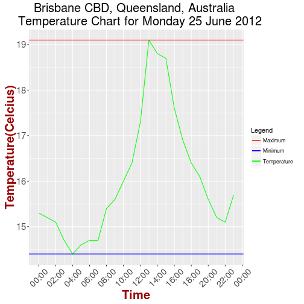

Brisbane CBD Weather for 2012 
========================================================
author: Barrie Hill  
date: 3 June 2016  
autosize: true
transition: fade
font-family: 'Helvetica'

Overview
========================================================
type: bslide
<small><small>
This presentation is part of the course project for the **Developing Data Products** subject of the **Data Science Specialization** course run by Coursera and Johns Hopkins University.

This **Reproducible Pitch Presentation** satisfies the following project requirements:

- It must be done in Slidify or Rstudio Presenter
- It must be 5 pages
- It must be hosted on github or Rpubs
- It must contained some embedded R code that gets run when slidifying the document

The presentation is written using **Rstudio Presenter**. It is **five pages** long and is hosted on **Rpubs**. **Slide 4 (Example Output)** contains **embedded R code** that runs when the presentation is compiled. The data is loaded and then filtered on the date, Monday 25 June 2012. Text and a chart relevant to this date are created by the **embedded R code** and displayed in **Slide 4**.

</small></small>

The Application
========================================================
type: bslide
<small><small><small>
This application ([bne-cbd-weather](https://barrie0482.shinyapps.io/bne-cbd-weather/)) displays weather information for the Brisbane Central Business District(CBD) for 2012. It is intended for use by a group of researchers who need to quicky view 2012 temperature and wind speed information for the Brisbane CBD. The [bne-cbd-weather](https://barrie0482.shinyapps.io/bne-cbd-weather/) application is browser based application available at the url https://barrie0482.shinyapps.io/bne-cbd-weather/.

The application provides a **Date Input**  text box that supplies an easy to use calendar to select the date to display. Clicking in the textbox will activate the calendar.   
  
Five tabs are provided in the application for the user:
- **Weather Details:** This tab displays the minimum and maximum Temperature and Windspeed for the selected date.
- **Temperature Plot:** This tab displays a plot of the temperature in for the selected date. The maximum temperature is marked with a red line and minimum temperature with a blue line.
- **Wind Speed Plot:** This tab displays a plot of the wind speed for the selected date. The maximum speed is marked with a red line and minimum speed with a blue line.
- **Help:** This tabe gives help on using the application
- **Project Description:** This tab gives a description of the project and links to various resources related to the project.

**Note:** _Valid dates for this application are from the 1st January 2012 (2012-01-01) until the 31st December 2012 (2012-12-31). If dates outside this range or an invalid date is entered, an error will be displayed on the page. Refresh the page to start again._</small></small></small>

Example Output
========================================================
type: bslide

<small><small><small>
The text below and the chart to the right are created from **embedded R code** that runs when the presentation is compiled. 

The text in _italics_ shows the maximum and minimum temperature temperatures for Monday 25 June 2012. The chart shows the temperature range for the same day. Minimum and maximum temperatures are indicated by the coloured lines at the top and bottom of the chart.

_On Monday 25 June 2012 the minimum temperature in the Brisbane Central Business District (CBD) was  14.4 degrees Celcius. The maximum temperature was 19.1 degrees  Celcius._

Similar details are also available in the application for wind speed.</small></small></small>

***

Application and Source Files
========================================================
type: bslide
<small>
The Application and this presentation can be found at the following locations.

- Application: https://barrie0482.shinyapps.io/bne-cbd-weather/
- This presentation:  https://rpubs.com/barrie0482/bne-cbd-weather

The source files for the application and presentation can be found at the following locations.

- Application Project Source Files: https://github.com/barrie0482/bne-cbd-weather
- Presentation Project Source Files: https://github.com/barrie0482/bne-cbd-weather-slides
</small>

